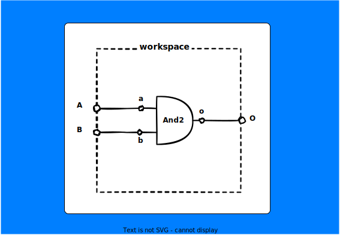

# Getting Started with Logic Code  
The following content will help you get started with Logic Code.

## 1. Install Logic Code  
You may visit the [Install page to view more info](/install/). Or in short, your system should have g++ , make and Nodejs ( with logic-code module installed globally).


## 2. Creating project  
You can create your project using init <project name>  
```
lcc init <project_name>
```
Then you will be asked "if you need to add stdcomp c++ library ". At present, logic code transpiles to c++ only and if you wish not to create your own components from scratch type yes. If you are a beginner hit yes.

This creates your project directory with the given Project Name. The project follows the following structure  


```

myFirstProject                  // project directory
├── config.json                 // configuration of your project
├── gen                         // generated Files
│   ├── build                   //      executable files
│   ├── config                  //      internal config like make config etc.
│   ├── lib                     //      c++ libs
│   │   └── stdcomp             //          installed stdcomp library
│   │       ├── stdcomp.cpp     //              c++ file for the library
│   │       ├── stdcomp.h       //              head file for the library
│   │       └── stdcomp.json    //              config for the library
│   └── tmp                     // stores temporary files
└── workspace.lc                // workspace file

```

By default, you are only allowed to create your .lc (logic code) files in the project directories , even though you could copy (import) other .lc file from folders inside the project directories.  
Also note that init has created workspace.lc , this is just a starting point for beginners. You could create a different file and create a wordspace  there.

## 3. Hello World Program  

Unfortunately, you can't print "Hello World " in logic code now. So lets build a simple AND gate. Open workspace.lc in your favourite code editor. It already has some blank template code. Some explanation has given after "//" ( Logic code doesn't support comment at present version ).
```

include("stdcomp/stdcomp"); // c++ library to be used during compilation.
                            // stdcomp provides some basic gates to work with.

workspace([]=>[])   // workspace is similar to a test bench.
{
    contains{       // defines components we need

    }
    wire{           // defines all the wire connections using "=>"

    }
    init{           // defines inital states
    
    }
    process{        // defines order of execution 

    }
}

```
Before starting , have reference of what we are going to build now.


Following are the changes to simulate AND gate:  

* Add input (A,B) and output (O) to workspace header. ie workspace([A,B]=>[O])
* Add "And2" (and gate with 2 inputs) to contains.here and1 is just a variable name of type And2. ie And2 and1;
* Connect all wires :  
    * Input of workspace to input of And2 module. ie A => and1.a; and B => and1.b;
    * Output of And2 module to output of workspace. ie and1.o => O;
* For now just skip init.
* Add and1 to process. ie and1;

Now our code will be  
```

include("stdcomp/stdcomp");

workspace([A,B]=>[O])
{
    contains{
        And2 and1;
    }
    wire{
        A => and1.a;
        B => and1.b;

        and1.o => O;     

    }
    init{
    
    }
    process{
        and1;
    }
}

```
Just note that using reserved keywords as variable names (including keywords of c++) can cause errors or undesireable results. So to avoid error don't use "and" as variable name for And2 gate.

## 4. Compile code  
Logic code transpiler transpiles logic code to c++ code, which can further compiled to executable.So make sure g++ and make is installed and added to $PATH. To transpile your logic code file run
```
    lcc <filename.lc>
```
here
```
    lcc workspace.lc
```

This would generate :  

* a cpp file
* make config file (make.json)
* Makefile  

Logic code takes care of the MakeFile genration and the make.json file holds the config for generating Makefile.

To build your project use make
```
make
```
This would generate the executable in the build folder.
## 5. Run Project  

Running the executable is similar to running other c++ executables. Also, there are several arguments that can be provided to configure the behaviour.
Here we are going to run it in the interactive mode. [You could find other arguments here](/runningExe/) .   

For Linux :
```
./gen/build/workspace -m i
```

This would ask you to provide the values for the inputs. Use Tab after each value to provide spacing and after providing all the inputs use Enter or Return, and Output will be calculated and printed.
  


```
processing at upp = 5. Ctrl + c to exit.
A	B	O	
0	0	0	
0   1   0
1   0   0
1   1   1

```  
   
     
        

##### [Next: Move to Half Adder](/gettingStarted2/)  