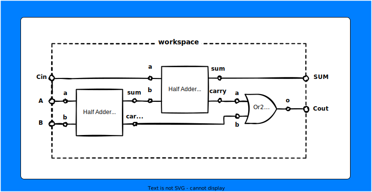

# Adder Circuit  
This tutorial will help you understant the basic concepts of logic code and will cover few more advanced concepts like module, copy and include.

## 1. Create Project  
Create a new Project using init  

```
lcc init adder
```

## 2. Create a Half Addder inside workspace.lc  
First, understand the circuit, do some research if you are not familiar. In short :
```
SUM = A XOR B       // where A,B are inputs
Carry = A AND B
```


## 3. Half Adder program  


```

include("stdcomp/stdcomp");

workspace([A,B]=>[SUM,Carry])
{
    contains{
        Xor2 xor1;
        And2 and1;
    }
    wire{
        A => xor1.a;
        B => xor1.b;

        xor1.o => SUM;

        A => and1.a;
        B => and1.b;

        and1.o => Carry;

    }
    init{
        [A] = [0];
        [B] = [0];    
    }
    process{
        xor1;
        and1;

    }
}

```  
Note , here we have used init section here, just to give you an understanding of it. Even though this is not necessary in this case, there may be circuits where output depends on the previous states, for instance flipflops.  Remember you only allowed initilize values for input ports in workspace and output ports in modules, as rest of the ports depend on other ports.

## 4. Complie the code and Run

Compile the code using  
```
// transpile lc to c++ code
lcc workspace.lc

// build
make

// execute in interactive mode
./gen/build/workspace -m i

```


```
processing at upp = 5. Ctrl + c to exit.
A	    B   	O	
0	    0   	0	
0       1       0
1       0       0
1       1       1
```

## 5. Creating a module
Modules allow us to create components ( in this case half adder ) and reuse it, similar to functions. Module also follows similar structure to workspace , but does have a name. You could create inside the workspace.lc file itself (doing now) or in a define it in a separate file (next section) and import using copy.  
A blank module structure would look like :  
```
module <ModuleName>([]=>[])
{
    contains{
    }
    wire{
    }
    init{
    }
    process{
    }
}
```

Note, Modules must be defined before its usage. Half adder module would look like :  

```
module HalfAdder([a,b]=>[sum,carry])
{
    contains{
        Xor2 xor1;
        And2 and1;
    }
    wire{
        a => xor1.a;
        b => xor1.b;

        xor1.o => sum;

        a => and1.a;
        b => and1.b;

        and1.o => carry;
    }
    init{
        [sum] = [0];
        [carry] = [0];
    }
    process{
        xor1;
        and1;
    }
}
```
We have changed some port name (example: A to a, SUM to sum etc), to help you understand better. Also we have changed the init section from a,b to sum, carry. As we have created HalfAdder module we have to change workspace to use this module. 

```
workspace([A,B]=>[S,C])
{
    contains{
        HalfAdder ha;
    }
    wire{
        A => ha.a;
        B => ha.b;

        ha.sum => S;
        ha.carry => C;
    }
    init{  
        [A] = [0];
        [B] = [0];
    }
    process{
        ha;
    }
}
```

Now our workspace.lc would look like :  

```
include("stdcomp/stdcomp");

module HalfAdder([a,b]=>[sum,carry])
{
    contains{
        Xor2 xor1;
        And2 and1;
    }
    wire{
        a => xor1.a;
        b => xor1.b;

        xor1.o => sum;

        a => and1.a;
        b => and1.b;

        and1.o => carry;
    }
    init{
        [sum] = [0];
        [carry] = [0];
    }
    process{
        xor1;
        and1;
    }
}

workspace([A,B]=>[S,C])
{
    contains{
        HalfAdder ha;
    }
    wire{
        A => ha.a;
        B => ha.b;

        ha.sum => S;
        ha.carry => C;

    }
    init{ 
        [A] = [0];
        [B] = [0];  
    }
    process{
        ha;
    }
}
```

Try running your project using : 
```
// transpile lc to c++ code
lcc workspace.lc

// build
make

// execute in interactive mode
./gen/build/workspace -m i

```
And you should get the same output as before:

```
processing at upp = 5. Ctrl + c to exit.
A	    B   	O	
0	    0   	0	
0       1       0
1       0       0
1       1       1
```


## 6. Splitting into separate files
Projects can become big soon and defining everything in a single file can no longer be possible. In order to avoid this logic code provide 2 ways to split you projects to smaller files.  
#### 1. include statement
Technically, include statements only helps you to import modules and gates from c++ files. But if your designed circuit in the c++ way [check Create your own c++ components ]. you could import it using include like you imported stdcomp. ie include("stdcomp/stdcomp");

```
include("<path to cpp component library's json file without .json");
```

#### 2. copy statement  
Copy statement allows you to import modules from another .lc file. Currently it is not possible to import only a particular component from a lc file, when you use copy every component in that file is available.

```
copy("path to the lc file");
```
## 7. Full Adder using Half Adder
This section helps you understand the use of copy statement. First understand the circuit. 



In order to simplify the code lets move our half adder to another file.  

Create a file named halfAdder.lc in the project directory and move our HalfAdder module to it. It is also important to include stdcomp in halfAdder.lc as our circuit depends on basic gates. So halfAdder.lc would look like:
```
include("stdcomp/stdcomp");

module HalfAdder([a,b]=>[sum,carry])
{
    contains{
        Xor2 xor1;
        And2 and1;
    }
    wire{
        a => xor1.a;
        b => xor1.b;

        xor1.o => sum;

        a => and1.a;
        b => and1.b;

        and1.o => carry;
    }
    init{
        [a] = [0];
        [b] = [0];
    }
    process{
        xor1;
        and1;
    }
}

```

And now lets create Full adder in our workspace.lc  

```
include("stdcomp/stdcomp");
copy("halfAdder.lc");

workspace([A,B,Cin]=>[SUM,Cout])
{
    contains{
        HalfAdder ha1,ha2;
        Or2 or1;
    }
    wire{
        A => ha1.a;
        B => ha1.b;

        ha1.sum => ha2.b;
        ha1.carry => or1.b;

        Cin => ha2.a;
        
        ha2.sum => SUM;
        ha2.carry => or1.a;

        or1.o => Cout;
    }
    init{ 
        [A] = [0];
        [B] = [0];
        [Cin] = [0];
    }
    process{
        ha1;
        ha2;
        or1;
    }
}

```

Try running your project using : 
```
// transpile lc to c++ code
lcc workspace.lc

// build
make

// execute in interactive mode
./gen/build/workspace -m i

```
Output:
```
processing at upp = 5. Ctrl + c to exit.
A	    B	    Cin 	SUM	    Cout	
0	    0	    0	    0	    0	
0       0       0       0       0
0       0       1       1       0
0       1       0       1       0
0       1       1       0       1
1       0       0       1       0
1       0       1       0       1
1       1       0       0       1
1       1       1       1       1
```

You have reached the end of the getting started section.Now you can explore logic code your own. Check :  

* [Components available in stdcomp](./stdcomp/)
* Rules to understand the basic rules of logic code.
* [Running modes to see different modes under wich you can run your code](./runningExe/)
* [Also make sure you check the currently unsupported features ](./unsupported/)